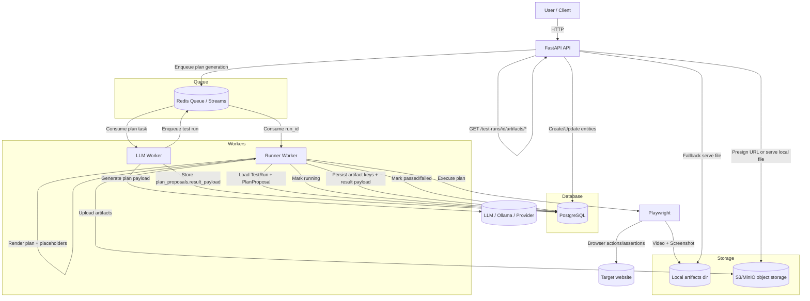

```mermaid
flowchart TD
%% ========== Actors / Components ==========
  U[User / Client] -->|HTTP| API[FastAPI API]

  subgraph Storage[Storage]
    FS[(Local artifacts dir)]
    S3[(S3/MinIO object storage)]
  end

  subgraph DB[Database]
    PG[(PostgreSQL)]
  end

  subgraph Queue[Queue]
    RQ[(Redis Queue / Streams)]
  end

  subgraph Workers[Workers]
    LLMW[LLM Worker]
    RUNW[Runner Worker]
  end

  %% ========== API ==========
  API -->|Create/Update entities| PG
  API -->|Enqueue plan generation| RQ

  %% ========== LLM Worker ==========
  RQ -->|Consume plan task| LLMW
  LLMW -->|Generate plan payload| LLM[(LLM / Ollama / Provider)]
  LLMW -->|Store plan_proposals.result_payload| PG
  LLMW -->|Enqueue test run| RQ

  %% ========== Runner Worker ==========
  RQ -->|Consume run_id| RUNW
  RUNW -->|Load TestRun + PlanProposal| PG
  RUNW -->|Render plan + placeholders| RUNW
  RUNW -->|Mark running| PG

  RUNW -->|Execute plan| PW[Playwright]
  PW -->|Browser actions/assertions| SITE[(Target website)]
  PW -->|Video + Screenshot| FS

  RUNW -->|Upload artifacts| S3
  RUNW -->|Persist artifact keys + result payload| PG
  RUNW -->|Mark passed/failed| PG

  %% ========== Artifact Retrieval ==========
  API -->|GET /test-runs/id/artifacts/*| API
  API -->|Presign URL or serve local file| S3
  API -->|Fallback serve file| FS
```
